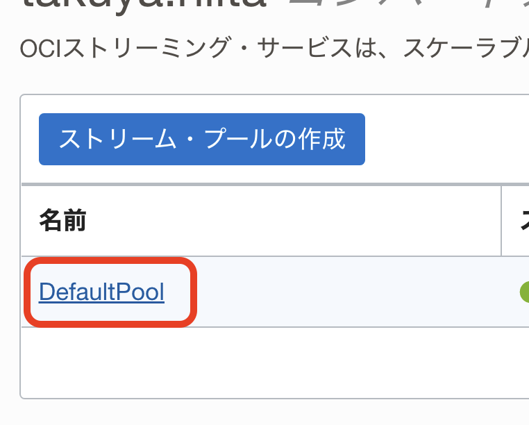

# ochacafe_serverless_on_k8s

---

[OCHaCafe Season6 #5 サーバレス on Kubernetes](https://ochacafe.connpass.com/event/266727/)のデモ資材

---

## 環境構築

### 1. 資材概要

```sh
.
├── README.md
├── keda => KEDAのデモ資材
│   ├── manifest　=> 環境構築用のManifest
│   └── sampleapp => デモで利用するサンプルアプリケーション
└── knative => Knativeのデモ資材
    ├── eventing => Eventingのデモを実施するための資材
    │   ├── eventing-src => Eventingのイベントソースを設定するManifest
    │   ├── eventing-svc => Eventingのワークロードを設定するManifest
    │   └── sampleapp　=> デモで利用するサンプルアプリケーション
    └── serving　=> Servingのデモを実施するための資材
        ├── autoscale => Servingのオートスケールを実施するための資材
        ├── sampleapp　=> デモで利用するサンプルアプリケーション
        └── traffic　=> Servingのトラフィックマネジメントを実施するためのManifest
```

### 2. OKEの構築

[こちら](https://oracle-japan.github.io/ocitutorials/cloud-native/oke-for-advances)の「1.OKEクラスタ構築」を実施してください。

### 3. Knativeのインストール

#### 3-1. Knative Servingのインストール

[こちら](https://knative.dev/docs/install/yaml-install/serving/install-serving-with-yaml/)に従って実施してください。  
なお、`Install a networking layer`では`Kourier`、`Configure DNS`では`Magic DNS (sslip.io)`を選択してください。  
`Install optional Serving extensions`は実施不要です。  

#### 3-2. Knative Eventingのインストール

[こちら](https://knative.dev/docs/install/yaml-install/eventing/install-eventing-with-yaml/)に従って実施してください。  
`Optional: Install a default Channel (messaging) layer`、`Optional: Install a Broker layer`、`Install optional Eventing extensions`は実施不要です。  

#### 3-3. Streamingのプロビジョニング

OCIのコンソールにログインし、ハンバーガーメニューをクリックします。  
リージョンは東京リージョンを選択してください。
`アナリティクスとAI`=>`ストリーミング`をクリックします。  


をクリックします。  

`ストリーム名`に`EventingDemo`を入力し、`作成`をクリックします。  
※`ストリーム名`はKafkaトピックに該当します


同じように、をクリックします。

`ストリーム名`に`KEDA-Demo`を入力、`既存ストリームプールの選択`をチェックし、`DefaultPool`を選択し、`作成`をクリックします。


ストリーム2つが作成できたら、ストリーム一覧の画面左にあるメニューから`ストリーム・プール`をクリックします。  


`DefaultPool`をクリックします。  



`Kafka接続設定`をクリックします。  


`すべてコピー`をクリックして、内容をメモ帳などに記録しておきます。  


最後に画面下部にある`トピックの自動生成`をチェックし、`設定の更新`をクリックします。  


#### 3-4. 認証トークンの作成

OCIコンソールの人型マークをクリックし、ユーザ名をクリックします。  


`認証トークン`をクリックします。  


をクリックします。  

`説明`に`Demo`と入力し、`トークンの生成`をクリックします。  


出力された認証トークンをメモ帳などに保存しておいてください。  

#### 3-5. オブジェクトストレージネームスペースの確認  

OCIコンソールの人型マークをクリックし、テナンシをクリックします。  


`テナンシ詳細`にある`オブジェクト・ストレージ・ネームスペース`の値をメモ帳などに記録しておきます。  


これで、環境構築は完了です。  

## 4. Knative Servingのデモ

### 4-1. ゼロスケール

ディレクトリを移動します。  

```sh
cd ochacafe_serverless_on_k8s/knative/serving/autoscale
```

デモ用のNamespaceを作成します。  

```sh
kubectl create ns serving-demo
```

Manifestを適用します。  

```sh
kubectl apply -f simple-svc-autoscale.yaml
```

Knative Serviceが作成されていることを確認します。  

```sh
kubectl get ksvc -n serving-demo
```

以下のように出力されればOKです。  

```sh
$ kubectl get ksvc -n serving-demo
NAME                             URL                                                                         LATESTCREATED                       LATESTREADY                           READY   REASON
simple-serving-ocha-demo-scale   http://simple-serving-ocha-demo-scale.serving-demo.xxx.xxx.xxx.xxx.sslip.io   simple-serving-ocha-demo-scale-v3   simple-serving-ocha-demo-scale-v3  　 True    
```

Postmanなどで以下のURLでアクセスします。  
ドメインは上記で取得した`http://simple-serving-ocha-demo-scale.serving-demo.xxx.xxx.xxx.xxx.sslip.io`を利用します。  

アクセスする前にPodをWatchしておきましょう。  
※Podが存在する場合はPodがTerminateされるまでしばらく待機してください。(90秒ほどでTerminateされます)

```sh
kubectl get pods -n serving-demo -w
```

```sh
http://simple-serving-ocha-demo-scale.serving-demo.xxx.xxx.xxx.xxx.sslip.io/simple-greet/OCHaCafe
```

アクセスすると以下のようにPodが0の状態から以下のようにPodが起動されます。  

```sh
$ kubectl get pods -n serving-demo -w
NAME                                                            READY   STATUS    RESTARTS   AGE
simple-serving-ocha-demo-scale-v3-deployment-7d76d4b544-ljx82   0/2     Pending   0          0s
simple-serving-ocha-demo-scale-v3-deployment-7d76d4b544-ljx82   0/2     Pending   0          0s
simple-serving-ocha-demo-scale-v3-deployment-7d76d4b544-ljx82   0/2     ContainerCreating   0          0s
simple-serving-ocha-demo-scale-v3-deployment-7d76d4b544-ljx82   1/2     Running             0          3s
simple-serving-ocha-demo-scale-v3-deployment-7d76d4b544-ljx82   2/2     Running             0          5s
```

### 4-2. オートスケール

負荷をかけるためのスクリプトを実行します。  

```sh
./k6.sh
```

以下のように複数のPodが起動してくることが確認できます。  

```sh
[opc@oci-tutorials-env ~]$ kubectl get pods -n serving-demo -w
NAME                                                            READY   STATUS    RESTARTS   AGE
simple-serving-ocha-demo-scale-v3-deployment-7d76d4b544-bv7fw   0/2     Pending   0          0s
simple-serving-ocha-demo-scale-v3-deployment-7d76d4b544-bv7fw   0/2     Pending   0          0s
simple-serving-ocha-demo-scale-v3-deployment-7d76d4b544-bv7fw   0/2     ContainerCreating   0          0s
simple-serving-ocha-demo-scale-v3-deployment-7d76d4b544-bv7fw   1/2     Running             0          3s
simple-serving-ocha-demo-scale-v3-deployment-7d76d4b544-bv7fw   2/2     Running             0          4s
simple-serving-ocha-demo-scale-v3-deployment-7d76d4b544-zvrwz   0/2     Pending             0          0s
simple-serving-ocha-demo-scale-v3-deployment-7d76d4b544-zvrwz   0/2     Pending             0          0s
simple-serving-ocha-demo-scale-v3-deployment-7d76d4b544-zvrwz   0/2     ContainerCreating   0          0s
simple-serving-ocha-demo-scale-v3-deployment-7d76d4b544-r5bg6   0/2     Pending             0          0s
simple-serving-ocha-demo-scale-v3-deployment-7d76d4b544-gsnxh   0/2     Pending             0          0s
simple-serving-ocha-demo-scale-v3-deployment-7d76d4b544-g6vqr   0/2     Pending             0          0s
simple-serving-ocha-demo-scale-v3-deployment-7d76d4b544-r5bg6   0/2     Pending             0          0s
simple-serving-ocha-demo-scale-v3-deployment-7d76d4b544-gsnxh   0/2     Pending             0          0s
simple-serving-ocha-demo-scale-v3-deployment-7d76d4b544-g6vqr   0/2     Pending             0          0s
simple-serving-ocha-demo-scale-v3-deployment-7d76d4b544-r5bg6   0/2     ContainerCreating   0          0s
simple-serving-ocha-demo-scale-v3-deployment-7d76d4b544-gsnxh   0/2     ContainerCreating   0          0s
simple-serving-ocha-demo-scale-v3-deployment-7d76d4b544-g6vqr   0/2     ContainerCreating   0          0s
simple-serving-ocha-demo-scale-v3-deployment-7d76d4b544-9nl22   0/2     Pending             0          0s
simple-serving-ocha-demo-scale-v3-deployment-7d76d4b544-9nl22   0/2     Pending             0          0s
simple-serving-ocha-demo-scale-v3-deployment-7d76d4b544-pqr2n   0/2     Pending             0          0s
simple-serving-ocha-demo-scale-v3-deployment-7d76d4b544-pqr2n   0/2     Pending             0          0s
simple-serving-ocha-demo-scale-v3-deployment-7d76d4b544-9nl22   0/2     ContainerCreating   0          0s
simple-serving-ocha-demo-scale-v3-deployment-7d76d4b544-pqr2n   0/2     ContainerCreating   0          0s
simple-serving-ocha-demo-scale-v3-deployment-7d76d4b544-zvrwz   1/2     Running             0          5s
simple-serving-ocha-demo-scale-v3-deployment-7d76d4b544-5vjqj   0/2     Pending             0          0s
simple-serving-ocha-demo-scale-v3-deployment-7d76d4b544-5vjqj   0/2     Pending             0          0s
simple-serving-ocha-demo-scale-v3-deployment-7d76d4b544-5vjqj   0/2     ContainerCreating   0          1s
simple-serving-ocha-demo-scale-v3-deployment-7d76d4b544-r5bg6   1/2     Running             0          6s
simple-serving-ocha-demo-scale-v3-deployment-7d76d4b544-gsnxh   1/2     Running             0          6s
simple-serving-ocha-demo-scale-v3-deployment-7d76d4b544-g6vqr   1/2     Running             0          6s
simple-serving-ocha-demo-scale-v3-deployment-7d76d4b544-pqr2n   1/2     Running             0          5s
simple-serving-ocha-demo-scale-v3-deployment-7d76d4b544-5vjqj   1/2     Running             0          4s
simple-serving-ocha-demo-scale-v3-deployment-7d76d4b544-9nl22   1/2     Running             0          6s
simple-serving-ocha-demo-scale-v3-deployment-7d76d4b544-zvrwz   2/2     Running             0          20s
simple-serving-ocha-demo-scale-v3-deployment-7d76d4b544-r5bg6   2/2     Running             0          20s
simple-serving-ocha-demo-scale-v3-deployment-7d76d4b544-gsnxh   2/2     Running             0          20s
simple-serving-ocha-demo-scale-v3-deployment-7d76d4b544-g6vqr   2/2     Running             0          20s
simple-serving-ocha-demo-scale-v3-deployment-7d76d4b544-9nl22   2/2     Running             0          20s
simple-serving-ocha-demo-scale-v3-deployment-7d76d4b544-pqr2n   2/2     Running             0          20s
simple-serving-ocha-demo-scale-v3-deployment-7d76d4b544-5vjqj   2/2     Running             0          21s
```

ディレクトリをもとに戻しておきます。  

```sh
cd ~
```

### 4-3. トラフィックマネジメント

ディレクトリを移動します。  

```sh
cd ochacafe_serverless_on_k8s/knative/serving/traffic
```

Manifestを順次適用します。  

```sh
kubectl apply -f simple-svc-v1.yaml
```

```sh
kubectl apply -f simple-svc-v2.yaml
```

```sh
kubectl apply -f simple-svc-v3.yaml
```

Knative Serviceを確認します。  
今回利用するのは`http://simple-serving-ocha-demo.serving-demo.xxx.xxx.xxx.xxx.sslip.io`です。

```sh
$ kubectl get ksvc -n serving-demo
NAME                             URL                                                                         LATESTCREATED                       LATESTREADY                         READY   REASON
simple-serving-ocha-demo         http://simple-serving-ocha-demo.serving-demo.xxx.xxx.xxx.xxx.sslip.io         simple-serving-ocha-demo-v3         simple-serving-ocha-demo-v3         True    
simple-serving-ocha-demo-scale   http://simple-serving-ocha-demo-scale.serving-demo.xxx.xxx.xxx.xxx.sslip.io   simple-serving-ocha-demo-scale-v3   simple-serving-ocha-demo-scale-v3   True    
```

Postmanなどで以下のURLでアクセスします。  
ドメインは上記で取得した`http://simple-serving-ocha-demo.serving-demo.xxx.xxx.xxx.xxx.sslip.io`を利用します。  

```sh
http://simple-serving-ocha-demo.serving-demo.xxx.xxx.xxx.xxx.sslip.io/simple-greet/OCHaCafe
```

レスポンスとしてv1、v2、v3がある程度均等に出力されることが確認できます。  
それぞれのPodが1つずつ起動する際には多少ラグが発生していることも確認できます。(いわゆる「コールドスタート」と呼ばれるものです)

ディレクトリをもとに戻しておきます。  

```sh
cd ~
```

## 5. Knative Eventingのデモ

ディレクトリを移動します。  

```sh
cd ochacafe_serverless_on_k8s/knative/eventing
```

まずは、デモで利用するNamespaceを作成します。  

```sh
kubectl create ns eventing-demo
```

Eventingで起動するワークロード(今回はKnative Servingを使います)を構築します。  

```sh
kubectl apply -f eventing-svc/kafka-serving.yaml
```

次に、イベントソースで利用するSecretを作成します。  

```sh
kubectl create secret -n default generic streaming-source-secret \
    --from-literal=password='<認証トークン>' \
    --from-literal=saslType="PLAIN" \
    --from-literal=user=='<ユーザ名>'
```

パラメータは以下のように設定します。  

key|value
---|---
user|[3-3.Streamingのプロビジョニング](#3-3-streamingのプロビジョニング)で記録したユーザ名
password|[3-4-認証トークンの作成](#3-4-認証トークンの作成)で生成した認証トークン

次に、Eventingのイベントソース(今回はKafka(OCI Streaming))を構築します。  
※東京リージョン以外で実施する場合、このManifestに記載されているブートストラップサーバを変更してください

```sh
kubectl apply -f eventing-src/kafkasource.yaml
```

Knative Serviveを確認します。  

```sh
kubectl get ksvc -n eventing-demo
```

以下のように表示されればOKです。

```sh
$ kubectl get ksvc -n eventing-demo
NAME                        URL                                                                     LATESTCREATED                  LATESTREADY                    READY   REASON
simple-eventing-ocha-demo   http://simple-eventing-ocha-demo.eventing-demo.xxx.xxx.xxx.xxx.sslip.io   simple-eventing-ocha-demo-v1   simple-eventing-ocha-demo-v1   True    
```

次にKafkaSourceを確認します。

```sh
kubectl get kafkasource -n eventing-demo
```

以下のように表示されればOKです。

```sh
$ kubectl get kafkasource -n eventing-demo
NAME                     TOPICS             BOOTSTRAPSERVERS                                           READY   REASON   AGE
kafka-source-ocha-demo   ["EventingDemo"]   ["cell-1.streaming.ap-tokyo-1.oci.oraclecloud.com:9092"]   True             4h8m     
```

PodをWatchしておきます。  

```sh
kubectl get pods -n eventing-demo -w
```

OCIコンソールを開き、[3-3.Streamingのプロビジョニング](#3-3-streamingのプロビジョニング)で表示したStreamingの一覧を開きます。  

`EventingDemo`をクリックします。  


`テスト・メッセージの生成`をクリックします。  


`データ`に`Hello OCHaCafe`と入力し、`生成`を2回程度クリックします。  


Podが以下のように起動します。  

```sh
$ kubectl get pods -n eventing-demo -w
NAME                                                       READY   STATUS    RESTARTS   AGE
simple-eventing-ocha-demo-v1-deployment-7dbd96c6bc-kn5pl   0/2     Pending   0          0s
simple-eventing-ocha-demo-v1-deployment-7dbd96c6bc-kn5pl   0/2     Pending   0          1s
simple-eventing-ocha-demo-v1-deployment-7dbd96c6bc-kn5pl   0/2     ContainerCreating   0          1s
simple-eventing-ocha-demo-v1-deployment-7dbd96c6bc-kn5pl   1/2     Running             0          3s
simple-eventing-ocha-demo-v1-deployment-7dbd96c6bc-kn5pl   2/2     Running             0          11s
```

Podのログを確認すると以下のように先ほどのテストメッセージが出力されています。  

```sh
kubectl logs simple-eventing-ocha-demo-v1-deployment-7dbd96c6bc-kn5pl -n eventing-demo -c user-container
 ~~~
2023.01.06 08:31:29 INFO com.ocha.sample.knative.SimpleEventConsume Thread[helidon-server-1,5,server]: =======New Message Received!!=======
2023.01.06 08:31:29 INFO com.ocha.sample.knative.SimpleEventConsume Thread[helidon-server-1,5,server]: ce-id=partition:0/offset:73
2023.01.06 08:31:29 INFO com.ocha.sample.knative.SimpleEventConsume Thread[helidon-server-1,5,server]: ce-source=/apis/v1/namespaces/eventing-demo/kafkasources/kafka-source-ocha-demo#EventingDemo
2023.01.06 08:31:29 INFO com.ocha.sample.knative.SimpleEventConsume Thread[helidon-server-1,5,server]: ce-specversion=1.0
2023.01.06 08:31:29 INFO com.ocha.sample.knative.SimpleEventConsume Thread[helidon-server-1,5,server]: ce-time=2023-01-06T08:31:23.747Z
2023.01.06 08:31:29 INFO com.ocha.sample.knative.SimpleEventConsume Thread[helidon-server-1,5,server]: ce-type=dev.knative.kafka.event
2023.01.06 08:31:29 INFO com.ocha.sample.knative.SimpleEventConsume Thread[helidon-server-1,5,server]: content-length=16
2023.01.06 08:31:29 INFO com.ocha.sample.knative.SimpleEventConsume Thread[helidon-server-1,5,server]: POST:Hello OCHaCafe!!
2023.01.06 08:31:29 INFO com.ocha.sample.knative.SimpleEventConsume Thread[helidon-server-1,5,server]: =======Message Consumed!!=======
2023.01.06 08:31:29 INFO com.ocha.sample.knative.SimpleEventConsume Thread[helidon-server-2,5,server]: =======New Message Received!!=======
2023.01.06 08:31:29 INFO com.ocha.sample.knative.SimpleEventConsume Thread[helidon-server-2,5,server]: ce-id=partition:0/offset:74
2023.01.06 08:31:29 INFO com.ocha.sample.knative.SimpleEventConsume Thread[helidon-server-2,5,server]: ce-source=/apis/v1/namespaces/eventing-demo/kafkasources/kafka-source-ocha-demo#EventingDemo
2023.01.06 08:31:29 INFO com.ocha.sample.knative.SimpleEventConsume Thread[helidon-server-2,5,server]: ce-specversion=1.0
2023.01.06 08:31:29 INFO com.ocha.sample.knative.SimpleEventConsume Thread[helidon-server-2,5,server]: ce-time=2023-01-06T08:31:23.982Z
2023.01.06 08:31:29 INFO com.ocha.sample.knative.SimpleEventConsume Thread[helidon-server-2,5,server]: ce-type=dev.knative.kafka.event
2023.01.06 08:31:29 INFO com.ocha.sample.knative.SimpleEventConsume Thread[helidon-server-2,5,server]: content-length=16
2023.01.06 08:31:29 INFO com.ocha.sample.knative.SimpleEventConsume Thread[helidon-server-2,5,server]: POST:Hello OCHaCafe!!
2023.01.06 08:31:29 INFO com.ocha.sample.knative.SimpleEventConsume Thread[helidon-server-2,5,server]: =======Message Consumed!!=======
```

カレントディレクトリをもとに戻します。

```sh
cd ~
```

## 5. KEDAのデモ

サンプルアプリケーションの設定を更新します。  

```sh
cd ochacafe_serverless_on_k8s/keda/sampleapp
```

`src/main/resources/application.yaml`を編集します。vimでもエディタでも構いません。  

```yaml
mp.messaging:
  incoming.keda-demo:
    connector: helidon-kafka
    topic: KEDA-Demo
    auto.offset.reset: latest
    enable.auto.commit: true
    group.id: keda-demo001

  connector:
    helidon-kafka:
      bootstrap.servers: <ブートストラップサーバー>
      sasl.mechanism: PLAIN
      security.protocol: SASL_SSL
      sasl.jaas.config: >-
        <SASL_CONFIG>
      key.serializer: org.apache.kafka.common.serialization.StringSerializer
      value.serializer: org.apache.kafka.common.serialization.StringSerializer
      key.deserializer: org.apache.kafka.common.serialization.StringDeserializer
      value.deserializer: org.apache.kafka.common.serialization.StringDeserializer

```

パラメータは以下のように設定し、保存します。  

key|value
---|---
<ブートストラップサーバー>|[3-3.Streamingのプロビジョニング](#3-3-streamingのプロビジョニング)で記録したブートストラップ・サーバー
<SASL_CONFIG>|[3-3.Streamingのプロビジョニング](#3-3-streamingのプロビジョニング)で記録したSASL接続文字列

サンプルアプリケーションのコンテナイメージをビルドします。  
ローカルにDockerエンジンが必要です。  
ここでは東京リージョンのOCIRにPushします。  
他のリージョンを利用する方は、[こちら](https://docs.oracle.com/ja-jp/iaas/Content/General/Concepts/regions.htm)から`リージョン・キー`をご確認ください。  
`<オブジェクト・ストレージ・ネームスペース>`には[3-5.オブジェクトストレージネームスペースの確認](#3-5-オブジェクトストレージネームスペースの確認)で確認した値を付与します。  

```sh
docker build -t nrt.ocir.io/<オブジェクト・ストレージ・ネームスペース>/keda-demo-app .
```

```sh
docker push nrt.ocir.io/<オブジェクト・ストレージ・ネームスペース>/keda-demo-app 
```

Manifestの設定を変更します。  

```sh
cd ochacafe_serverless_on_k8s/keda/manifest
```

`keda-consume-deploy`を編集します。vimでもエディタでも構いません。  

```yaml
apiVersion: apps/v1
kind: Deployment
metadata:
  name: keda-demo-deploy
  namespace: keda-demo
  labels:
    app: keda-demo-deploy
spec:
  replicas: 1
  selector:
    matchLabels:
      app: keda-demo-deploy
  template:
    metadata:
      labels:
        app: keda-demo-deploy
    spec:
      containers:
      - name: keda-demo-deploy
        image: <コンテナイメージパス>
        imagePullPolicy: Always
        ports:
        - containerPort: 8080
```

以下のパラメータを設定し、保存します。

key|value
---|---
image|前手順でビルドしたコンテナイメージ名(東京リージョンの場合は`nrt.ocir.io/<オブジェクトストレージネームスペース>/keda-demo-app`)

デモ用のNamespaceを作成します。  

```sh
kubectl create ns keda-demo
```

`kafka-secret.yaml`を開き、Secretを環境に合わせて修正します。  

```yaml
apiVersion: v1
kind: Secret
metadata:
  name: keda-kafka-secrets
  namespace: keda-demo
data:
  sasl: cGxhaW50ZXh0Cg==
  tls: ZW5hYmxlCg==
  username: <ユーザ名>
  password: <認証トークン>
```

以下のパラメータを設定します。

key|value
---|---
user|[3-3.Streamingのプロビジョニング](#3-3-streamingのプロビジョニング)で記録したユーザ名をBase64エンコードした値
password|[3-4-認証トークンの作成](#3-4-認証トークンの作成)で生成した認証トークンをBase64エンコードした値

例えば、以下のようになります。  

```yaml
apiVersion: v1
kind: Secret
metadata:
  name: keda-kafka-secrets
  namespace: keda-demo
data:
  sasl: cGxhaW50ZXh0Cg==
  tls: ZW5hYmxlCg==
  username: b3Jhc2VqYXBhbi9vcmFjbGVpZGVudGl0eWNsb3Vkc2VydmljZS95YXRzdXRhcm8ubmlpdGFAb3JhY2xlLmNvbS9vY2lkMS5zdHJlYW1wb29sLm9jMS5hcC10b2t5by0xLmFtYWFhYWFhc3NsNjVpcWF4ZXBuemd4c2FzYWFzYXNhc3hhYXF1eW1jYTJnZ3E1cXRh
  password: I3ZyZXdmcndlZndlciRGUkdS
```

適用します。  

```sh
kubectl apply -f kafka-secret.yaml
```

Deploymentを適用します。  

```sh
kubectl apply -f kafka-consume-deploy.yaml
```

最後にScaledObjectを適用します。  

```sh
kubectl apply -f keda-kafka-scaledobj.yaml
```

ScaledObjectの状態を確認します。  

```sh
kubectl get ScaledObject -n keda-demo
```

以下のように出力されればOKです。

```sh
$ kubectl get ScaledObject -n keda-demo
NAME                 SCALETARGETKIND      SCALETARGETNAME    MIN   MAX   TRIGGERS   AUTHENTICATION                       READY   ACTIVE   FALLBACK   AGE
kafka-scaledobject   apps/v1.Deployment   keda-demo-deploy   0     10    kafka      keda-trigger-auth-kafka-credential   True    False    False      15d
[opc@oci-tutorials-env eventing]$ 
```

PodをWatchしておきます。  

```sh
kubectl get pods -n keda-demo -w
```

OCIコンソールを開き、[3-3.Streamingのプロビジョニング](#3-3-streamingのプロビジョニング)で表示したStreamingの一覧を開きます。  

`KEDA-Demo`をクリックします。  


`テスト・メッセージの生成`をクリックします。  


`データ`に`Hello OCHaCafe`と入力し、`生成`を2回程度クリックします。  


Podが以下のように起動します。  

```sh
$ kubectl get pods -n keda-demo -w
NAME                                READY   STATUS    RESTARTS   AGE
keda-demo-deploy-559bf79ff8-drhtf   0/1     Pending   0          0s
keda-demo-deploy-559bf79ff8-drhtf   0/1     Pending   0          0s
keda-demo-deploy-559bf79ff8-drhtf   0/1     ContainerCreating   0          0s
keda-demo-deploy-559bf79ff8-drhtf   1/1     Running             0          2s
```

Podのログを確認します。

```sh
$ kubectl logs keda-demo-deploy-559bf79ff8-drhtf -n keda-demo
~~~
2023.01.06 08:50:02 INFO KafkaConsumerDemo Thread[kafka-9,5,main]: =======New Message Received!!=======
2023.01.06 08:50:02 INFO KafkaConsumerDemo Thread[kafka-9,5,main]: message: Hello OCHaCafe!!
2023.01.06 08:50:02 INFO KafkaConsumerDemo Thread[kafka-9,5,main]: =======Message Consumed!!=======
2023.01.06 08:50:02 INFO KafkaConsumerDemo Thread[kafka-9,5,main]: =======New Message Received!!=======
2023.01.06 08:50:02 INFO KafkaConsumerDemo Thread[kafka-9,5,main]: message: Hello OCHaCafe!!
2023.01.06 08:50:02 INFO KafkaConsumerDemo Thread[kafka-9,5,main]: =======Message Consumed!!=======
```
